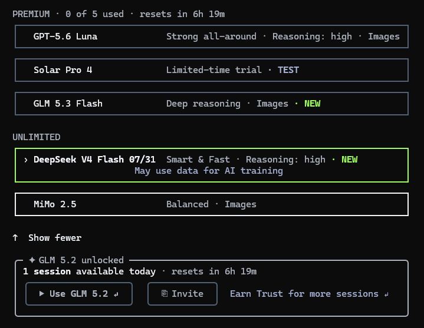

# free-ai-api

[English](README.en.md) | [简体中文](README.md)

A collection of platforms offering free access to AI model APIs.

## B-AI

- link: [chat.b.ai](https://chat.b.ai/chat?invite_code=BL9UBT)
- Invite code: `BL9UBT`

Free models:

- `deepseek-v4-flash`
- `deepseek-v4-flash-vision-exp`
- `hy3`
- `mimo-v2.5`
- `glm-5.3-flash`
- `qwen3.8-flash`

> Note: `deepseek-v4-flash-vision-exp` is free for API use only; `glm-5.3-flash` and `qwen3.8-flash` are free on the API now and become free on Chat once listed.

## FreeBuf

-  link: [freebuff.com](https://freebuff.com/?ref=ref-3eb0adde-9983-48f6-9bf3-de3c271c62de)

## Freemodel

-  link: [freemodel.dev](https://freemodel.dev/invite/FRE-e71f7daa)

A platform for using frontier AI models for free, with the slogan "Frontier AI, free for everyone".

Get **$300 in free API credits** upon sign-up: no credit card required, no hidden fees, ready to use right away; occasional bonus credits of $100 are also given away.

Available models:

- `claude-opus-4-7`
- `claude-sonnet-4-6`
- `claude-haiku-4-5-20251001`

## TokenLB

-  link: [tokenlb.net](https://tokenlb.net/sign-up?aff=iqik)

Supported models:

- `claude-opus-4-7`
- `claude-opus-4-6`
- `claude-sonnet-4-6`
- `gpt-5.5`
- `gpt-5.4`
- `gpt-5.4-mini`
- `gemini-3-flash-preview`
